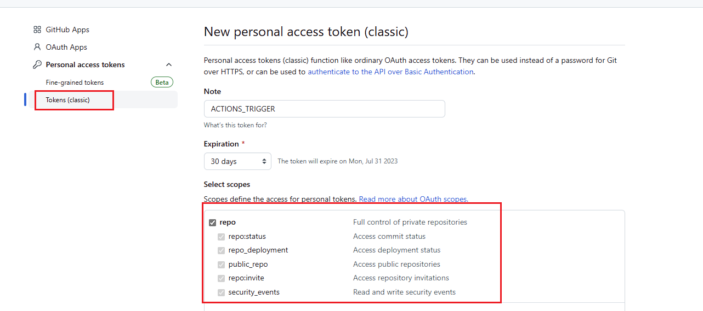

<h1 align="center">

<strong>OpenWrt Action</strong>

</h1>

<h3 align="center">
A workflow for building <a href="https://github.com/openwrt/openwrt/">OpenWrt</a> with Github Actions.
</h3>

## 功能

- 自定义 `feeds update` 执行前的脚本 `before_feeds_update.sh` 。
- 自定义 `feeds install` 执行后的脚本 `after_feeds_install.sh` 。
- 自定义编译配置文件 `.config` 。
- 自定义文件的目录 `files` 。

## 编译 OpenWrt

编译 OpenWrt 的工作流文件，提供一些自定义功能。

> 相关文件：`.github/workflows/build_openwrt.yml` 。

- 使用自定义环境变量

```yaml
env:
  REPO_URL: https://github.com/openwrt/openwrt
  REPO_BRANCH: main
  FEEDS_CONF: feeds.conf.default
  MENU_CONF: .config
  BEFORE_FEEDS_UPDATE: before_feeds_update.sh
  AFTER_FEEDS_INSTALL: after_feeds_install.sh
  UPLOAD_BIN_DIR: false
  UPLOAD_FIRMWARE: true
  UPLOAD_RELEASE: true
  TZ: Asia/Shanghai
```

| 环境变量                | 描述                                   |
|---------------------|--------------------------------------|
| REPO_URL            | 源码仓库地址                               |
| REPO_BRANCH         | 源码分支                                 |
| FEEDS_CONF          | 本地仓库根目录中自定义 `feeds` 配置文件名称（可选）       |
| MENU_CONF           | 本地仓库根目录中自定义 `menu config` 配置文件名称（可选） |
| BEFORE_FEEDS_UPDATE | 执行 `feeds update -a` 前执行的脚本名称        |
| AFTER_FEEDS_INSTALL | 执行 `feeds install -a` 后执行的脚本名称       |
| UPLOAD_BIN_DIR      | 是否上传 bin 目录                          |
| UPLOAD_FIRMWARE     | 是否上传固件目录                             |
| UPLOAD_RELEASE      | 是否上传固件到 release                      |
| TZ                  | 时区                                   |

- 若存在 `FEEDS_CONF` 则会覆盖 `OpenWrt` 源码目录下的相关文件。
- 若存在 `MENU_CONF` 则会覆盖 `OpenWrt` 源码目录下的相关文件。
- 若启用 `UPLOAD_RELEASE` 则必须设置 `Workflow permissions` 为 `Read and write permissions` 。
  - 这将允许工作流对仓库进行操作（在此处为允许工作流发布版本）。


## 源码更新后自动编译

检测到 `REPO_URL` 所指地址的源码更新后，将自动执行 `build_openwrt.yml` 工作流。

> 相关文件：`.github/workflows/update-checker.yml` 。

- 使用自定义环境变量

```yaml
env:
  REPO_URL: https://github.com/openwrt/openwrt
  REPO_BRANCH: main
```

| 环境变量        | 描述     |
|-------------|--------|
| REPO_URL    | 源码仓库地址 |
| REPO_BRANCH | 源码分支   |

- 创建 [Personal Access Token(PAT)](https://github.com/settings/tokens/new)，勾选 `repo` 权限，`update-checker.yml`
   工作流将使用此令牌触发编译工作流。



- 仓库选择 `Settings` 选项卡，创建名为 `ACTIONS_TRIGGER_PAT` 的加密环境变量。


## 自定义文件

在项目根目录创建 `files` 目录，并将相关文件放入其中。

## License

[GPL License](LICENSE)
